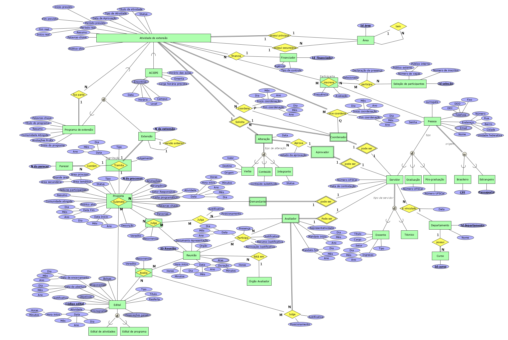

# LAB BD - TURMA A

## Sobre o projeto
O projeto proposto oferece uma solução para o gerenciamento das atividades de extensão
que ocorrem na Universidade Federal de São Carlos, UFSCar. Será um plataforma usável por todos
aqueles que têm contato com a Extensão da universidade.

## Como contribuir?
0. Faça um *Fork* deste projeto;
1. Selecione a issue referente ao que deseja contribuir e avise que irá trabalhar nela;
2. No seu repositório, crie uma nova branch com um nome descritivo (referente ao o que está fazendo, por exemplo tabela-x).
3. Acrescente suas alterações à branch criada.
4. Faça um *Merge Request*.

## Esquema do banco
